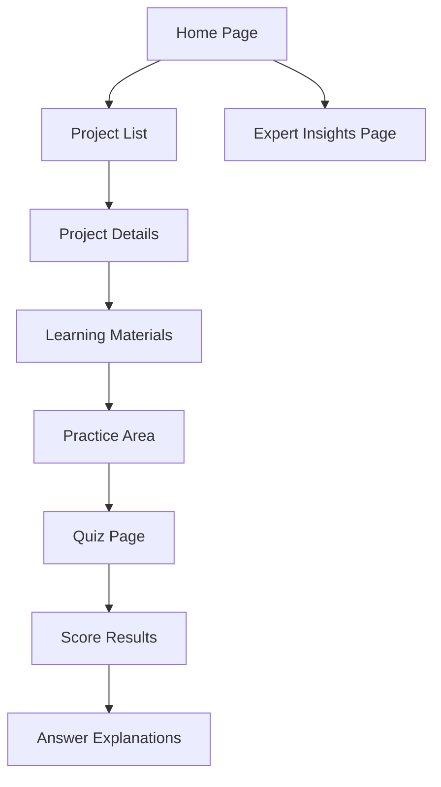

## 1. Product Overview
Python数据分析训练项目网站，提供10个基于pandas的实践项目和100道考题，帮助学习者掌握数据分析技能。
- 目标用户为数据分析初学者和希望提升技能的专业人士
- 产品价值在于提供系统化的实践训练和评估体系，结合AI时代背景

## 2. Core Features

### 2.1 User Roles
| Role | Registration Method | Core Permissions |
|------|---------------------|------------------|
| Visitor | No registration required | Access all training materials and quizzes |

### 2.2 Feature Module
1. **Home page**: Hero section, project list, expert insights overview
2. **Project pages**: Project details, learning materials, code examples
3. **Quiz pages**: Questions, answer submissions, scoring
4. **Expert insights page**: Core thinking patterns, controversial topics

### 2.3 Page Details
| Page Name | Module Name | Feature description |
|-----------|-------------|---------------------|
| Home page | Hero section | Introduction to the platform, key features highlight |
| Home page | Project list | Display 10 training projects with brief descriptions |
| Home page | Expert insights overview | Summary of expert thinking patterns and controversial topics |
| Project pages | Project details | Detailed description of the project, learning objectives |
| Project pages | Learning materials | Step-by-step guide, code examples, data cleaning techniques |
| Project pages | Practice area | Interactive code editor for hands-on practice |
| Quiz pages | Question display | 10 questions per project with multiple choice and code-based questions |
| Quiz pages | Answer submission | Submit answers and receive immediate feedback |
| Quiz pages | Scoring system | Calculate and display scores with detailed explanations |
| Expert insights page | Core thinking patterns | Five expert-recognized core thinking patterns in data analysis |
| Expert insights page | Controversial topics | Three hotly debated topics with arguments from both sides |

## 3. Core Process
User visits the home page → Browses available projects → Selects a project to learn → Reads learning materials → Practices with code examples → Takes the quiz → Reviews answers and explanations → Explores expert insights

## 4. User Interface Design
### 4.1 Design Style
- Primary color: #4B6BFB (blue)
- Secondary color: #22C55E (green)
- Accent color: #F97316 (orange)
- Button style: Rounded corners, subtle shadow
- Font: Inter (sans-serif) for body, Montserrat for headings
- Layout style: Card-based with clean spacing
- Icon style: Modern, minimal line icons

### 4.2 Page Design Overview
| Page Name | Module Name | UI Elements |
|-----------|-------------|-------------|
| Home page | Hero section | Large header with animated data visualization, call-to-action button |
| Home page | Project list | Grid of project cards with icons, titles, and brief descriptions |
| Home page | Expert insights overview | Collapsible sections with key points |
| Project pages | Project details | Header with project title, progress indicator, navigation tabs |
| Project pages | Learning materials | Step-by-step instructions with code blocks and visual aids |
| Project pages | Practice area | Interactive code editor with syntax highlighting |
| Quiz pages | Question display | Clean question cards with clear formatting for code and text |
| Quiz pages | Answer submission | Radio buttons or code input fields, submit button |
| Quiz pages | Scoring system | Progress bar, score display, detailed feedback |
| Expert insights page | Core thinking patterns | Card-based layout with icons and detailed explanations |
| Expert insights page | Controversial topics | Tabbed interface for different topics, with pros and cons sections |

### 4.3 Responsiveness
- Desktop-first design with mobile adaptation
- Responsive grid layout that adjusts based on screen size
- Touch-optimized buttons and interactive elements for mobile devices
- Collapsible navigation menu for small screens

### 4.4 3D Scene Guidance
- Not applicable for this project