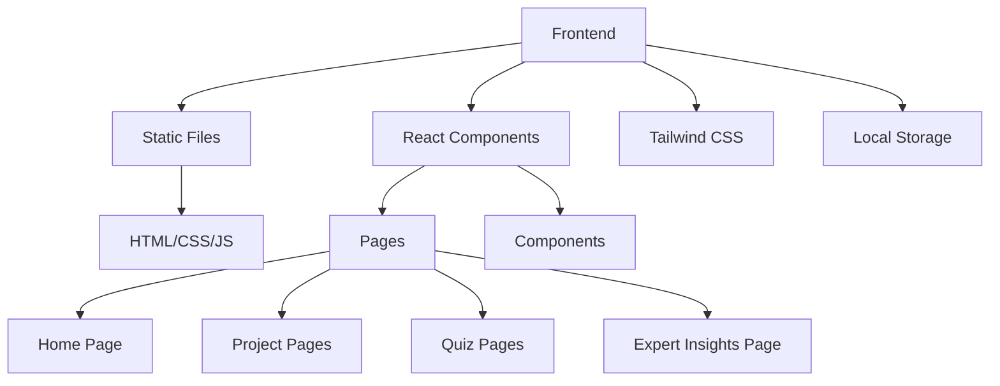
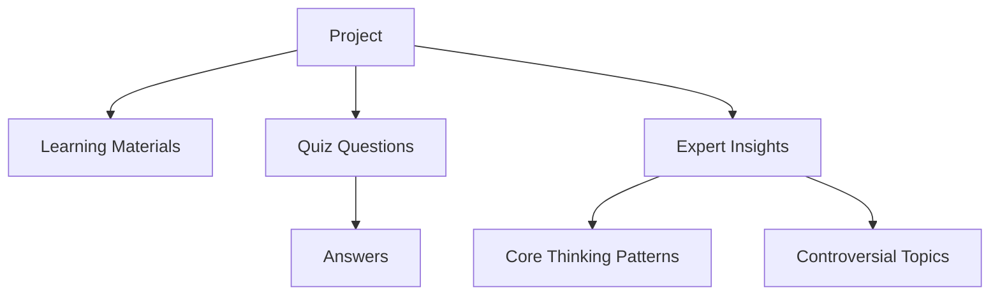

## 1. Architecture Design

## 2. Technology Description
- Frontend: React@18 + Tailwind CSS@3 + Vite
- Initialization Tool: Vite-init
- Backend: None (static website)
- Database: None (data stored in JSON files)
- Deployment: Cloudflare Pages

## 3. Route Definitions
| Route | Purpose |
|-------|---------|
| / | Home page with project list and expert insights overview |
| /project/:id | Project details page with learning materials |
| /quiz/:id | Quiz page for the selected project |
| /expert-insights | Expert insights page with core thinking patterns and controversial topics |

## 4. API Definitions
- No backend API required for this static website

## 5. Server Architecture Diagram
- Not applicable for static website

## 6. Data Model
### 6.1 Data Model Definition

### 6.2 Data Definition
- Projects: Array of project objects with id, title, description, learning materials, and quiz questions
- Learning Materials: Step-by-step guides, code examples, and data cleaning techniques
- Quiz Questions: Array of question objects with id, type, content, options, correct answer, and explanation
- Expert Insights: Core thinking patterns and controversial topics with detailed explanations

## 7. Implementation Details
### 7.1 Project Structure
- src/
  - components/: Reusable UI components
  - pages/: Main page components
  - data/: JSON files for projects, quizzes, and expert insights
  - utils/: Utility functions
  - styles/: Global styles

### 7.2 Key Features Implementation
- Interactive code editor: Using CodeMirror or Monaco Editor
- Quiz scoring: Client-side calculation and storage
- Responsive design: Tailwind CSS breakpoints
- Navigation: React Router for client-side routing

### 7.3 Deployment
- Build process: `npm run build` to generate static files
- Deployment: Cloudflare Pages with automatic builds from GitHub

### 7.4 Performance Optimization
- Code splitting: Lazy loading for larger components
- Image optimization: Compressed images and responsive sizing
- Caching: Leverage browser caching for static assets